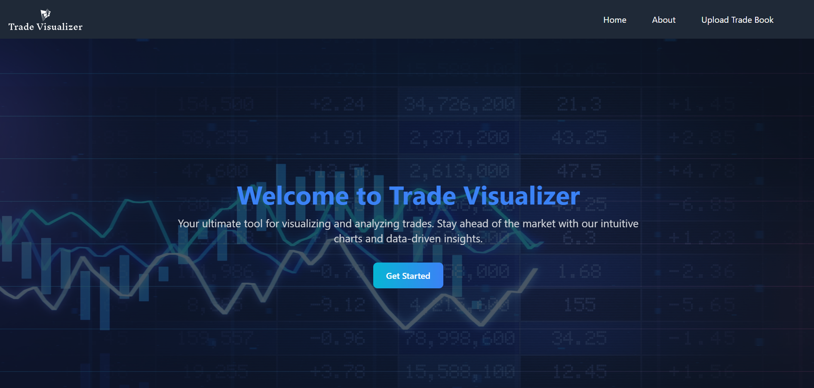
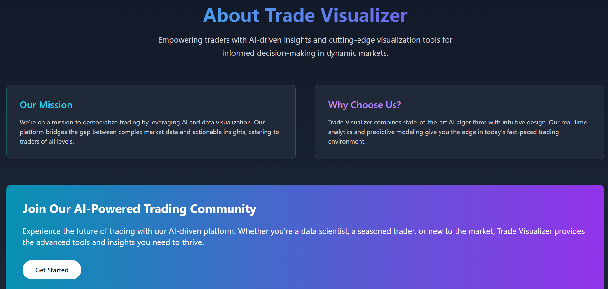
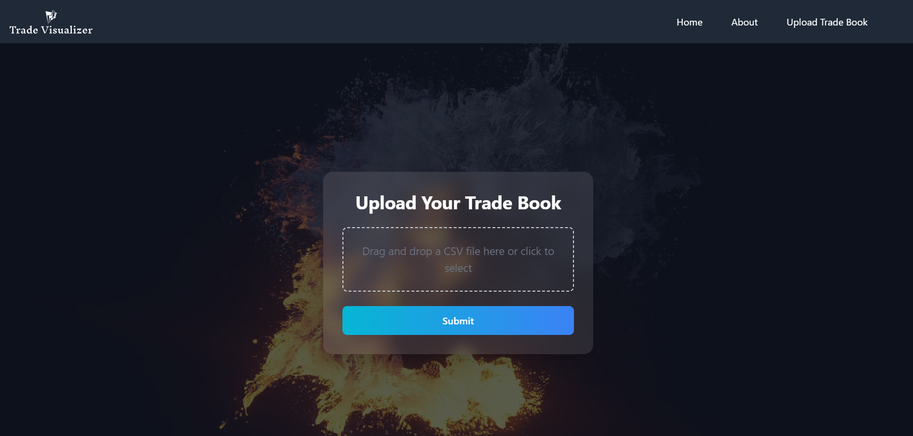
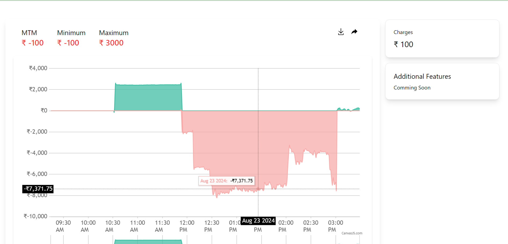

# 🚀 Trade Visualizer

**Trade Visualizer** is a powerful web tool designed for analyzing and visualizing trading data through interactive graphs. This tool provides traders with valuable insights by displaying key metrics and ensuring a seamless user experience across all devices.

## ✨ Features

- 📊 **Interactive Graphs**: Analyze trading data with dynamic, interactive visualizations.
- 📈 **Comprehensive Metrics**: Display crucial information such as **MTM (Mark-to-Market)**, **minimum**, **maximum**, and **trading charges** for thorough analysis.
- 🖥️ **User-Friendly Interface**: Present uploaded trades in an easy-to-understand tabular format.
- 📱 **Responsive Design**: Fully responsive layout, ensuring a seamless experience on any device.
- 🔧 **Scalable Solution**: Built using modern web technologies for a robust and scalable trade visualization platform.

## 🛠️ Tech Stack

- **Frontend**:  
- **Backend**: 

## 🚀 Getting Started

1. **Clone the repository**:
   ```bash
   git clone https://github.com/DEV-SHUKLA-GITHUB/trade-visualizer.git
   ```
2. **Install Dependencies**:
   ```bash
   npm install
   ```
3. **Run the application**:
   ```bash
   npm run dev
   ```
## 📷 Screenshots

| Feature       | Screenshot |
| ------------- | ----------- |
| **HomePage** |  |
| **About Page**       |  |
| **Upload Page**  |  |
| **Dashboard**  |  |
## Made with ❤️ by Dev


